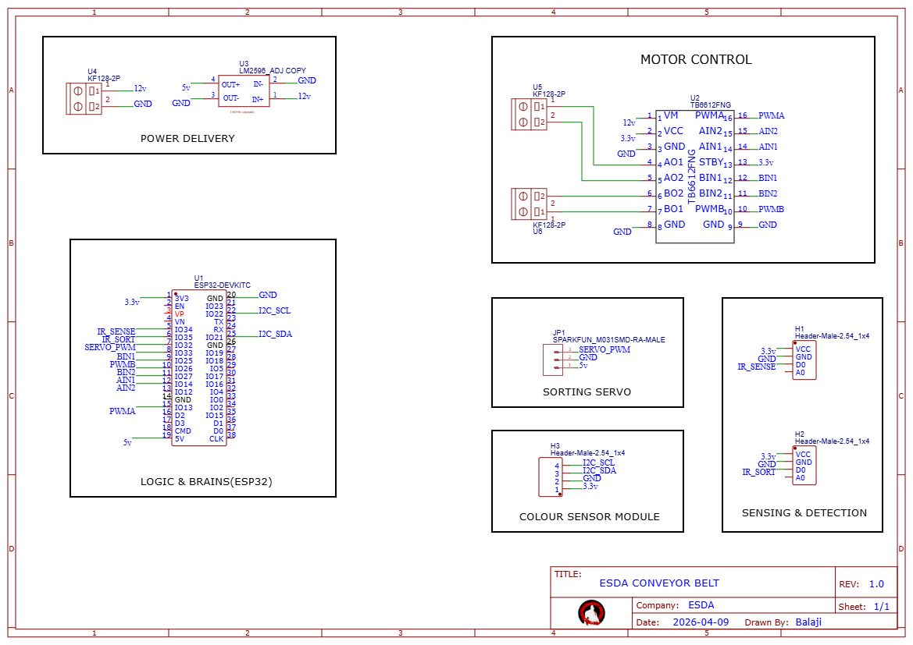
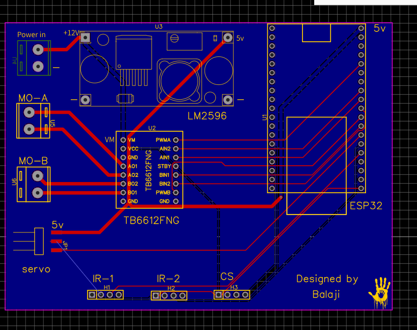
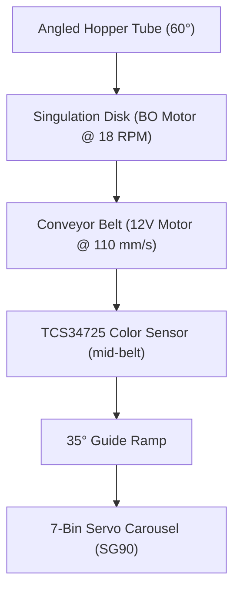
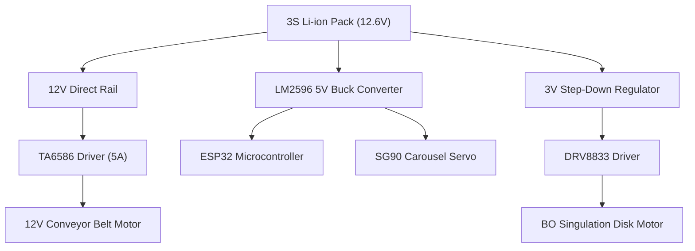

# 🔬 GemSort — Automated Color-Based Gem Sorting System

> An autonomous electro-mechanical pipeline that sorts Cadbury Gems into 7 color bins at 96–100% accuracy using HSV color classification, peak saturation tracking, and closed-loop servo control on an ESP32.

🎥 **[Watch the Project Demo Video on Google Drive](https://drive.google.com/file/d/1If60X-r_dOjUWOp34JZycRMH2XUS1AAb/view?usp=drive_link)**

### 📸 Physical Build Gallery

| Hopper Assembly | Singulation Disk | 7-Bin Carousel |
| :---: | :---: | :---: |
|  |  |  |

| Conveyor Belt (Pic 1) | Conveyor Belt (Pic 2) |
| :---: | :---: |
|  |  |

### 🎛️ Design Schematic & PCB Layout

| Circuit Schematic | PCB Design Layout |
| :---: | :---: |
|  |  |

---

## ⚡ Key Metrics

| Metric | Value |
|--------|-------|
| **Colors Sorted** | 7 (Red, Pink, Orange, Yellow, Green, Blue, Purple) |
| **Average Accuracy** | ~97% (4 colors at 100%) |
| **Sensor** | TCS34725 RGB+Clear (I2C, 24ms integration, 4× gain) |
| **Belt Speed** | ~110 mm/s |
| **Power** | 3S Li-ion (12.6V) with 3-rail PDN |
| **Engineering Pivots** | 10 major design iterations |

### Sorting Accuracy

| Color | Accuracy | Notes |
|-------|----------|-------|
| Red | 96.5% | Overlaps with dark orange at hue boundary |
| Pink | 98.5% | Separated from red by saturation (<64%) |
| Orange | 94.0% | Dark orange edge case near red threshold |
| Yellow | **100%** | — |
| Green | **100%** | — |
| Blue | **100%** | — |
| Purple | **100%** | — |

---

## 🏗️ Mechanical Pipeline



### Key Dimensions
| Component | Specification |
|-----------|---------------|
| Gem size | 13mm diameter × 6mm thick |
| Base board | Plywood sheet base |
| Separator disk | 80mm diameter, hole at 26mm from center |
| Conveyor belt | 300mm × 50mm, ~43mm above base |
| Ramp angle | 35° |
| Carousel | 100mm diameter, 7 bins |
| Hopper tube | 60° angle, 17mm inner diameter |

---

## 🧠 Color Detection Algorithm

### 1. Hole Detection (State Machine)
The singulation disk is covered in **matte black paper**. The TCS34725's Clear channel detects when the hole passes under the sensor:

| Clear Value | State | Action |
|-------------|-------|--------|
| C < 200 | Black paper (idle) | Wait |
| 200 ≤ C ≤ 430 | Hysteresis deadband | No action (prevents chatter) |
| C > 430 | Hole detected | Begin scanning |

### 2. Peak Saturation Tracker
On hole detection, the system captures **7 rapid readings over ~250ms** (20ms apart) and keeps only the sample with the **highest saturation**. This guarantees the reading comes from the gem's dead center — immune to edge shadows where the gem meets the wood plate.

### 3. Wood Detection (Empty Hole Filter)
```
Wood reference RGB: (225, 150, 110)
Euclidean distance = √((R-225)² + (G-150)² + (B-110)²)
If distance < 45 → Empty hole, ignore
```

### 4. White Spot Anomaly Filter
A scratch on the matte black disk creates a consistent false reading:
```
If Hue ∈ [15°, 30°] AND Saturation < 55% → Ignore (disk anomaly)
```

### 5. HSV Classification
Raw 16-bit RGB from TCS34725 is converted to HSV. Color is classified by **hue range**, with Red vs. Pink uniquely separated by **saturation**:

| Color | Hue Range | Sat Condition | Servo Angle |
|-------|-----------|---------------|-------------|
| Purple | 300°–350° | — | 170° |
| Red | >350° or <8° | ≥ 64% | 10° |
| Pink | >350° or <8° | < 64% | 35° |
| Orange | 8°–20° | — | 60° |
| Yellow | 20°–55° | — | 85° |
| Green | 55°–140° | — | 110° |
| Blue | 140°–260° | — | 140° |

---

## ⚡ Power Distribution Network & PCB Design



* **Power Rails:** 3S Li-ion battery (12.6V) down-converted to 5V via LM2596 buck converter (supplying ESP32 + SG90 Servo) and down-converted to 3V for the DRV8833 BO Motor. The 12V motor runs directly off the 12V rail driven by a TA6586 (5A) motor driver.
* **Brownout Fix:** SG90 servo was causing ESP32 transient resets when actuating under load. Resolved by wiring the servo power directly to the LM2596 5V output, bypassing the ESP32's onboard regulator.
* **PCB Layout:** Designed a 2-layer board in EasyEDA. High-current motor drivers are isolated on the left side and sensitive logic is placed on the right, utilizing a full bottom copper ground pour to mitigate electromagnetic interference (EMI).

---

## 🔧 Hardware Configuration

| Component | Role | Interface |
|-----------|------|-----------|
| **ESP32 DevKit** | Main system controller | — |
| **TCS34725** | RGB+Clear color sensor | I2C (GPIO 21/22) |
| **SG90 Servo** | Carousel bin selector | GPIO 15, 50Hz PWM |
| **12V Motor** | Conveyor belt drive | TA6586 via GPIO 12/14 |
| **BO Motor (3-6V)** | Singulation disk rotation | DRV8833 via GPIO 27/26 |
| **2× IR Sensors** | Gem presence detection | Digital GPIO |
| **LM2596** | 5V buck converter (Servo & MCU power) | — |

---

## 📁 Repository Structure

📂 **`GemSort_Calibration/`** — Sensor calibration firmware (Serial telemetry)  
📂 **`GemSort_Master_Control/`** — Core sorting machine firmware  
📂 **`servo_calibration/`** — Interactive angle calibration utility  
📂 **`images/`** — High-resolution photos of physical assemblies  
📄 **`Schematic_ESDA_2026-04-09.png`** — Complete electrical system schematic  
📄 **`PCB_Design.png`** — 2-Layer printed circuit board design layout  
📄 **`ESDA_Portfolio_Final_Balaji(EAC24011).pdf`** — Final technical portfolio report  
📄 **`README.md`** — Core project documentation  

---

## 🚀 Getting Started

### Prerequisites
- **Arduino IDE** with ESP32 board package (Core 2.x or 3.x)
- Libraries: `Adafruit_TCS34725`, `ESP32Servo`

### Flashing Main Controller
1. Open `GemSort_Master_Control/GemSort_Master_Control.ino`
2. Select board: **ESP32 Dev Module**
3. Click **Upload**

### Wiring Map
| Function | GPIO |
|----------|------|
| Belt Motor IN1/IN2 | 12 / 14 |
| Disk Motor IN1/IN2 | 27 / 26 |
| Servo Signal | 15 |
| TCS34725 SDA/SCL | 21 / 22 |

---

## 🔬 Lessons Learned & Engineering Pivots

1. **TB6612FNG Burned Out** — The original motor driver couldn't handle the 12V motor's stall current. Upgraded to TA6586 (5A continuous) for the belt and DRV8833 for the lighter BO motor. Lesson: always check stall current, not just running current.
2. **RGB → HSV Was Everything** — Initial RGB-based classification failed under different lighting. Switching to HSV made color detection nearly lighting-independent. The hue dimension isolates color from brightness.
3. **Peak Saturation Tracking** — Early fixed-delay readings were inconsistent because the gem could be at the edge of the sensor's view. Taking 7 rapid samples and keeping the highest saturation guaranteed a center read every time.
4. **The White Spot** — A small scratch on the matte black disk consistently triggered false "orange" classifications. Rather than fixing the physical disk, I added a mathematical filter (hue + saturation guard) to reject the anomaly. Pragmatic > perfect.
5. **4-Hole → 1-Hole Disk** — The original 4-hole design caused timing chaos with multiple gems in flight. Simplifying to a single hole made the system deterministic — one gem at a time, always.
6. **Servo Brownout** — The SG90 pulling current through the ESP32's 3.3V regulator caused transient resets. Wiring servo power directly to the 5V buck converter eliminated the issue entirely.

---

## 👤 Author

**Balaji Rayudu S**  
B.Tech Electronics & Computers Engineering, Semester IV  
Amrita Vishwa Vidyapeetham, Bengaluru

*Course: ESDA (Electronic Systems Design & Automation)*
